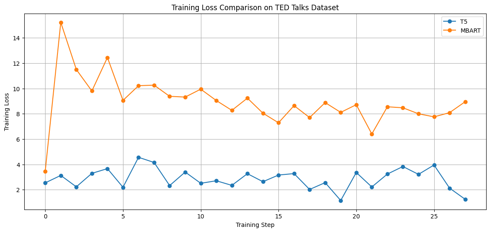
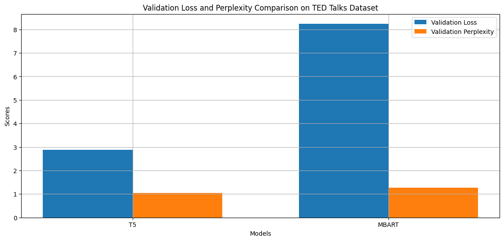
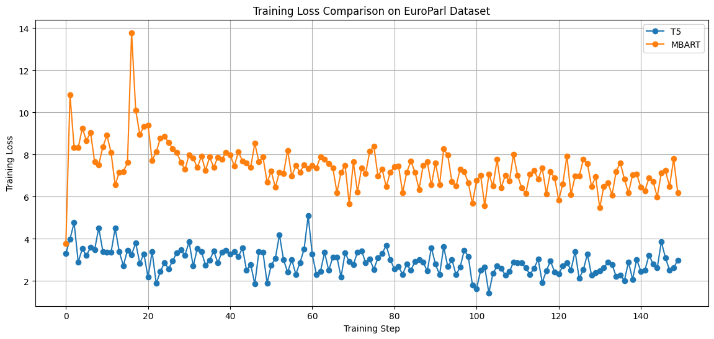
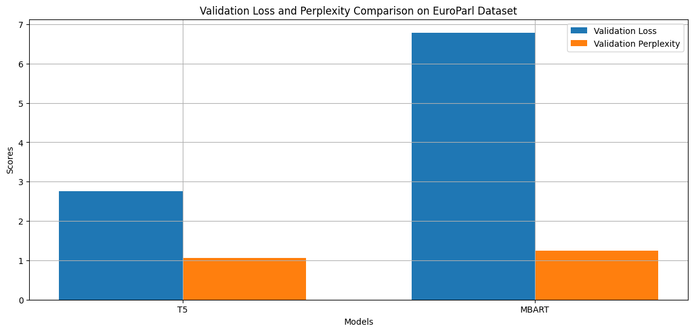
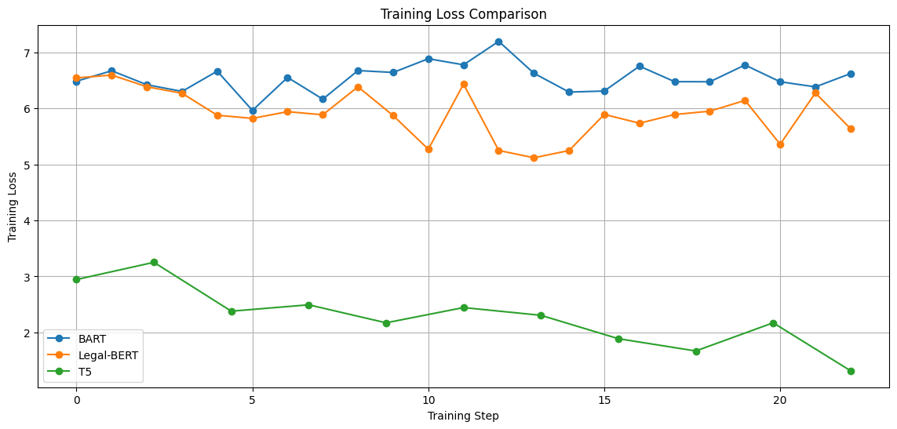
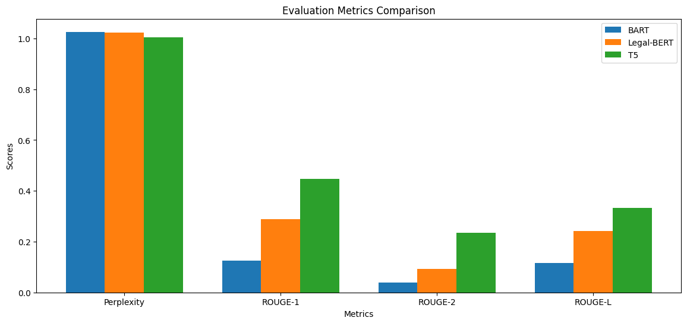

# SIMPLe

Summarizing and Improving Multilingual Public Legal Documents

## Project Overview

This project focuses on the development and comparison of various state-of-the-art models for legal text summarization and translation tasks. The models explored so far for summarization include BART, Legal-BERT, and T5. For translation, we have explored mBART (multilingual BART) and T5. The results are evaluated across three datasets: LexiSum, EuroParl, and TED Talks, to assess the models' performance in various tasks and document types.

## Models Overview

### Summarization Models

#### 1. **BART (Bidirectional and Auto-Regressive Transformers)**

BART is a transformer model that combines an encoder-decoder architecture and functions as a denoising autoencoder. Pretrained on a corrupted text reconstruction task, BART is particularly effective for sequence-to-sequence tasks such as text summarization. The pretrained weights used for BART in this project are sourced from **"facebook/bart-large-cnn"** on [Hugging Face](https://huggingface.co/facebook/bart-large-cnn).

**Architecture**: BART's architecture consists of a bidirectional encoder and an autoregressive decoder, which work together to generate summaries by encoding the input text and decoding the output sequence.

#### 2. **Legal-BERT**

Legal-BERT is a specialized model based on the BERT architecture, fine-tuned on legal corpora to handle domain-specific content. For this project, Legal-BERT is used in a seq2seq format, integrating Legal-BERT as an encoder with a compatible decoder for summarization. The pretrained weights for Legal-BERT are sourced from **"nlpaueb/legal-bert-base-uncased"** on [Hugging Face](https://huggingface.co/nlpaueb/legal-bert-base-uncased).

**Architecture**: Legal-BERT's encoder-decoder setup uses a BERT encoder paired with a GPT-2 decoder configured with cross-attention. This combination is well-suited for handling the complex structure of legal documents.

#### 3. **T5 (Text-to-Text Transfer Transformer)**

T5 treats all NLP tasks as a text-to-text problem, utilizing a consistent encoder-decoder framework for both input and output sequences. This model is highly versatile and adapts well to tasks such as summarization. The pretrained weights for T5 are sourced from **"t5-large"** on [Hugging Face](https://huggingface.co/t5-large).

**Architecture**: T5's architecture is a unified encoder-decoder structure that processes input text through the encoder and generates output through the decoder, with shared weights and a comprehensive training approach for various NLP tasks.

### Translation Models

#### 1. **mBART (Multilingual BART)**

mBART is an extension of BART designed for multilingual translation tasks. It is trained on diverse multilingual corpora, making it effective for handling multiple languages and translation directions. The pretrained weights for mBART used in this project are sourced from **"facebook/mbart-large-50-many-to-many-mmt"** on [Hugging Face](https://huggingface.co/facebook/mbart-large-50-many-to-many-mmt).

**Architecture**: mBART's architecture includes a multilingual encoder-decoder framework that supports conditional text generation across languages, leveraging attention mechanisms for cross-lingual translation.

#### 2. **T5 (Text-to-Text Transfer Transformer)**

In addition to its capabilities for summarization, T5 is also effective for translation tasks due to its flexible text-to-text approach. The pretrained weights used for T5 in translation tasks are sourced from **"t5-large"** on [Hugging Face](https://huggingface.co/t5-large).

**Architecture**: T5's encoder-decoder structure is equally applicable for translation, processing the source language text through the encoder and generating the target language translation via the decoder.

## Training and Evaluation Configuration

### Training Setup

For each model, the following training configuration is used:

-   **Batch Size**: 16
-   **Learning Rate**: 3e-5
-   **Max Epochs**: 10
-   **Learning Rate Scheduler**: Step-based with `lr_step_size` set to 10 and `lr_gamma` set to 0.1
-   **Loss Metric**: Cross-Entropy Loss

### Implementation Notes

-   **BART**, **Legal-BERT**, and **T5** for summarization are implemented with the `AutoModelForSeq2SeqLM` and custom configurations for handling long input sequences.
-   **mBART** and **T5** for translation are implemented similarly, utilizing pretrained tokenizers such as `MBart50Tokenizer` for multilingual support.

## Sources of Pretrained Weights

-   **BART**: [facebook/bart-large-cnn](https://huggingface.co/facebook/bart-large-cnn)
-   **Legal-BERT**: [nlpaueb/legal-bert-base-uncased](https://huggingface.co/nlpaueb/legal-bert-base-uncased)
-   **T5**: [t5-large](https://huggingface.co/t5-large)
-   **mBART**: [facebook/mbart-large-50-many-to-many-mmt](https://huggingface.co/facebook/mbart-large-50-many-to-many-mmt)

---

## Datasets

### 1. **Multi-LexSum**

The Multi-LexSum dataset, available [here](https://huggingface.co/datasets/allenai/multi_lexsum), is designed for benchmarking abstractive summarization models on a collection of multi-document sources. It includes different lengths and granularities of legal documents, annotated with expert-authored summaries: the experts—lawyers and law students—are trained to follow carefully created guidelines, and their work is reviewed by an additional expert to ensure quality.

### 2. **EuroParl**

The EuroParl dataset, accessible [here](https://huggingface.co/datasets/Helsinki-NLP/europarl), consists of parallel text from the proceedings of the European Parliament. It provides a multilingual corpus that is beneficial for training and evaluating models on formal, legislative language across different European languages. This dataset tests the models' capabilities in handling structured, domain-specific discourse and multilingual translation contexts.

### 3. **TED Talks (IWSLT)**

The TED Talks dataset, available [here](https://huggingface.co/datasets/IWSLT/ted_talks_iwslt), is sourced from the International Workshop on Spoken Language Translation (IWSLT). It includes English transcripts of TED Talks, featuring diverse topics and speaking styles. The dataset is used to evaluate models on spoken language summarization, which involves understanding informal and complex sentence structures.

## Progress Report Results Overview

### Translation Models on TED Talks Dataset

Below is the visualization of the training for mBART and T5 on the translation task on TED Talks for english to spanish:

****

Below is the equivalent visualization of the validation metrics for mBART and T5 on the same translation task on TED Talks for english to spanish translation:

****

### Translation Models on EuroParl Dataset

Below is the visualization of the training for mBART and T5 on the translation task on EuroParl for english to spanish:

****

Below is the equivalent visualization of the validation metrics for mBART and T5 on the same translation task on EuroParl for english to spanish translation:

****

### Summarization Models on Multi-LexSum Dataset

Below is the visualization of the training for BART, Legal-BERT and T5 on the summarization task on Multi-LexSum for long summaries:

****

Below is the equivalent visualization of the validation metrics for BART, Legal-BERT and T5 on the same summarization task on Multi-LexSum for long summaries:

****

## Conclusion

The results show that:

-   **T5** consistently performs well across all datasets, demonstrating low training and validation loss, as well as strong ROUGE scores.
-   **Legal-BERT** excels in domain-specific applications, particularly with legal texts, where it achieves competitive ROUGE scores and lower perplexity.
-   **BART** provides reliable summarization for general-purpose text but shows varied results depending on the dataset.

These findings indicate that while T5 is a robust general-purpose summarization model, domain-specific models like Legal-BERT are essential for specialized tasks.
