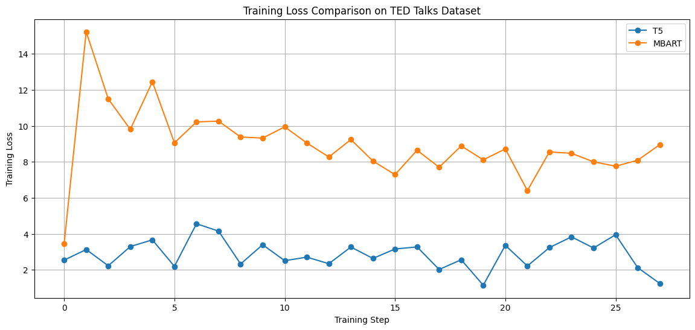
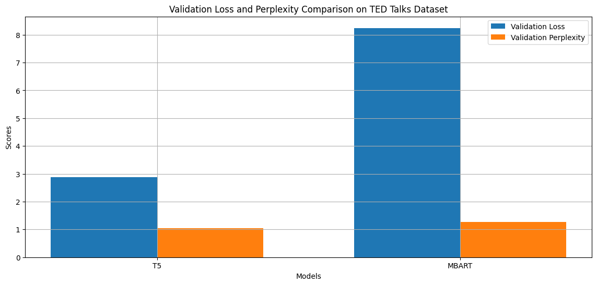
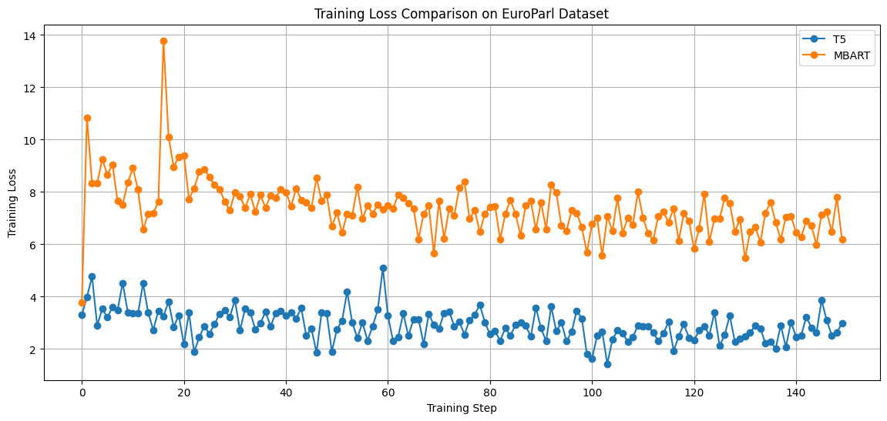
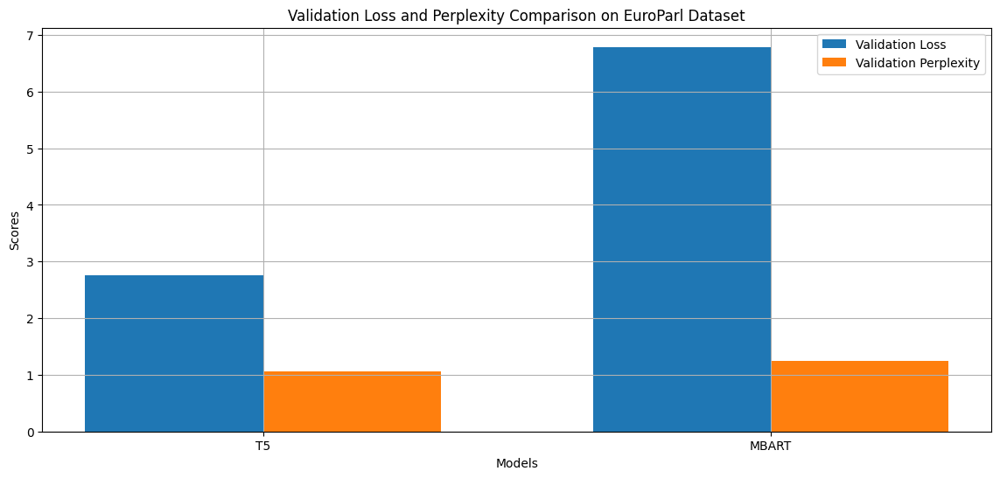
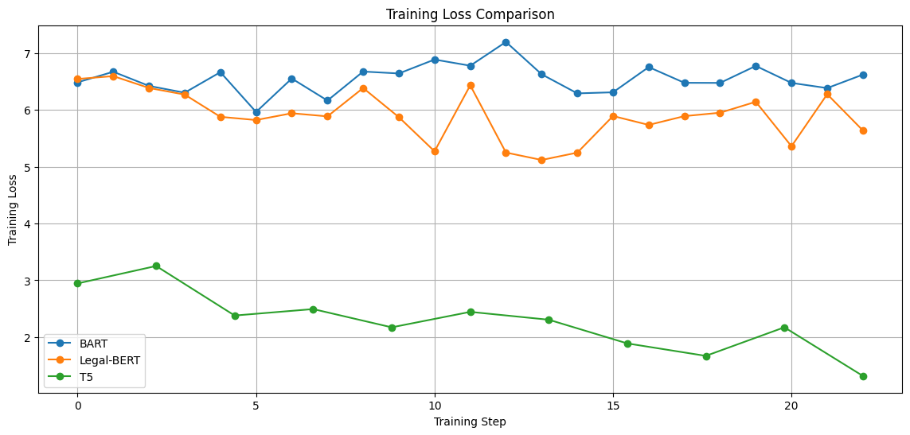
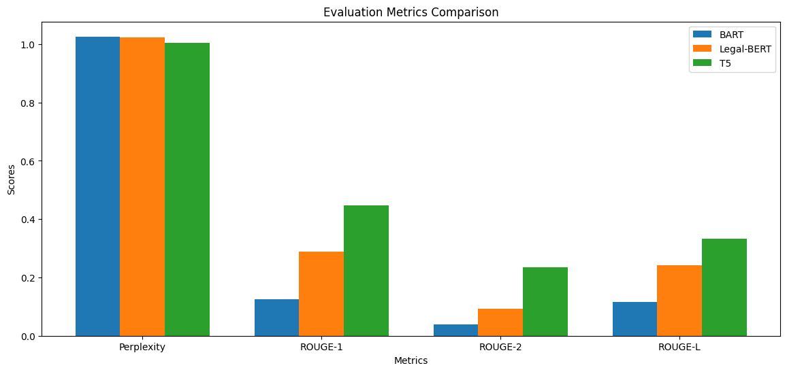

# SIMPLe

Summarizing and Improving Multilingual Public Legal Documents

## Project Overview

This project focuses on the development and comparison of various state-of-the-art models for legal text summarization and translation tasks. The models explored so far for summarization include BART, Legal-BERT, and T5. For translation, we have explored mBART (multilingual BART) and T5. The results are evaluated across three datasets: LexiSum, EuroParl, and TED Talks, to assess the models' performance in various tasks and document types.

## Models Overview

### Summarization Models

#### 1. **BART (Bidirectional and Auto-Regressive Transformers)**

BART is a transformer model that combines an encoder-decoder architecture and functions as a denoising autoencoder. Pretrained on a corrupted text reconstruction task, BART is particularly effective for sequence-to-sequence tasks such as text summarization. The pretrained weights used for BART in this project are sourced from **"facebook/bart-large-cnn"** on [Hugging Face](https://huggingface.co/facebook/bart-large-cnn).

**Architecture**: BART's architecture consists of a bidirectional encoder and an autoregressive decoder, which work together to generate summaries by encoding the input text and decoding the output sequence.

#### 2. **Legal-BERT**

Legal-BERT is a specialized model based on the BERT architecture, fine-tuned on legal corpora to handle domain-specific content. For this project, Legal-BERT is used in a seq2seq format by warm-starting both the encoder and the decoder from Legal-BERT. The pretrained weights for Legal-BERT are sourced from **"nlpaueb/legal-bert-base-uncased"** on [Hugging Face](https://huggingface.co/nlpaueb/legal-bert-base-uncased).

**Architecture**: Legal-BERT is used as a BERT2BERT encoder-decoder (`EncoderDecoderModel.from_encoder_decoder_pretrained`): both sides start from the Legal-BERT weights and share its tokenizer, and only the decoder's cross-attention layers are trained from scratch.

#### 3. **T5 (Text-to-Text Transfer Transformer)**

T5 treats all NLP tasks as a text-to-text problem, utilizing a consistent encoder-decoder framework for both input and output sequences. This model is highly versatile and adapts well to tasks such as summarization. Inputs are prefixed with `summarize: `, as in T5's pretraining. The pretrained weights for T5 are sourced from **"t5-large"** on [Hugging Face](https://huggingface.co/t5-large).

**Architecture**: T5's architecture is a unified encoder-decoder structure that processes input text through the encoder and generates output through the decoder, with shared weights and a comprehensive training approach for various NLP tasks.

### Translation Models

#### 1. **mBART (Multilingual BART)**

mBART is an extension of BART designed for multilingual translation tasks. It is trained on diverse multilingual corpora, making it effective for handling multiple languages and translation directions. The pretrained weights for mBART used in this project are sourced from **"facebook/mbart-large-50-many-to-many-mmt"** on [Hugging Face](https://huggingface.co/facebook/mbart-large-50-many-to-many-mmt).

**Architecture**: mBART's architecture includes a multilingual encoder-decoder framework that supports conditional text generation across languages, leveraging attention mechanisms for cross-lingual translation.

#### 2. **T5 (Text-to-Text Transfer Transformer)**

In addition to its capabilities for summarization, T5 can be fine-tuned for translation thanks to its text-to-text approach. Inputs are prefixed with `translate English to Spanish: `. Note that the original T5 was pretrained mostly on English (C4) and only on English→German/French/Romanian translation, so English→Spanish has to be learned during fine-tuning. The pretrained weights used for T5 in translation tasks are sourced from **"t5-large"** on [Hugging Face](https://huggingface.co/t5-large).

**Architecture**: T5's encoder-decoder structure is equally applicable for translation, processing the source language text through the encoder and generating the target language translation via the decoder.

## Training and Evaluation Configuration

### Training Setup

For each model, the following training configuration is used (set under `trainer.params` in `configs/model/*.yaml`):

-   **Batch Size**: 16
-   **Optimizer**: AdamW, learning rate 3e-5, weight decay 0.01
-   **Max Epochs**: 5, with early stopping on validation loss
-   **Learning Rate Scheduler**: Step-based with `lr_step_size` set to 10 and `lr_gamma` set to 0.1
-   **Loss**: token-level cross-entropy computed by the Hugging Face model, with padding ignored
-   **Seed**: 42

### Evaluation

-   **Translation**: corpus-level SacreBLEU
-   **Summarization**: corpus-level ROUGE-1/2/L F-measure
-   **Perplexity**: `exp` of the mean validation/test loss over the epoch. It is only comparable between models that share a tokenizer.
-   Outputs are generated with beam search (4 beams) up to `max_target_length` tokens.

### Implementation Notes

-   **BART** and **T5** are loaded with `AutoModelForSeq2SeqLM`; **Legal-BERT** is built as a BERT2BERT `EncoderDecoderModel`.
-   **mBART** uses `MBart50Tokenizer` with the `en_XX`/`es_XX` language codes, and generation is forced to start with `es_XX`.
-   Multi-LexSum source documents are much longer than the 512-token input limit, so only the beginning of each case is seen by the models.
-   TED talks are split into line-aligned sentence pairs before tokenization.
-   Casing, punctuation and accents are preserved during preprocessing.

## Usage

```bash
pip install -r requirements.txt   # or: conda env create -f environment.yml
export PROJECT_ROOT=$(pwd)

# train one model on one dataset (see train.sh for all combinations)
python src/train.py model=t5_translate data=europarl task_name=t5_europarl

# evaluate a checkpoint
python src/eval.py model=t5_translate data=europarl ckpt_path=/path/to/checkpoint.ckpt

# fast offline tests, and the tests that download models/datasets
pytest
pytest -m integration
```

`data.dataset.subset_fraction` controls how much of each split is used (1% for EuroParl by default).

## Sources of Pretrained Weights

-   **BART**: [facebook/bart-large-cnn](https://huggingface.co/facebook/bart-large-cnn)
-   **Legal-BERT**: [nlpaueb/legal-bert-base-uncased](https://huggingface.co/nlpaueb/legal-bert-base-uncased)
-   **T5**: [t5-large](https://huggingface.co/t5-large)
-   **mBART**: [facebook/mbart-large-50-many-to-many-mmt](https://huggingface.co/facebook/mbart-large-50-many-to-many-mmt)

---

## Datasets

### 1. **Multi-LexSum**

The Multi-LexSum dataset, available [here](https://huggingface.co/datasets/allenai/multi_lexsum), is designed for benchmarking abstractive summarization models on a collection of multi-document sources. It includes different lengths and granularities of legal documents, annotated with expert-authored summaries: the experts—lawyers and law students—are trained to follow carefully created guidelines, and their work is reviewed by an additional expert to ensure quality.

### 2. **EuroParl**

The EuroParl dataset, accessible [here](https://huggingface.co/datasets/Helsinki-NLP/europarl), consists of parallel text from the proceedings of the European Parliament. It provides a multilingual corpus that is beneficial for training and evaluating models on formal, legislative language across different European languages. This dataset tests the models' capabilities in handling structured, domain-specific discourse and multilingual translation contexts.

### 3. **TED Talks (IWSLT)**

The TED Talks dataset, available [here](https://huggingface.co/datasets/IWSLT/ted_talks_iwslt), is sourced from the International Workshop on Spoken Language Translation (IWSLT). It includes transcripts of TED Talks and their translations, featuring diverse topics and speaking styles. The dataset is used to evaluate English→Spanish translation of spoken, informal language.

## Progress Report Results Overview

> **Note:** the figures and conclusions below were produced before several pipeline bugs were fixed: perplexity was computed as `exp(loss / num_tokens)`, the splits were reduced to roughly 0.01% of the data, padding was included in the loss, mBART had no target-language code, T5 had no task prefix, Spanish accents were stripped, and the Legal-BERT decoder was randomly initialized. The results need to be regenerated before the comparisons below can be relied on.

### Translation Models on TED Talks Dataset

Below is the visualization of the training for mBART and T5 on the translation task on TED Talks for english to spanish:

****

Below is the equivalent visualization of the validation metrics for mBART and T5 on the same translation task on TED Talks for english to spanish translation:

****

### Translation Models on EuroParl Dataset

Below is the visualization of the training for mBART and T5 on the translation task on EuroParl for english to spanish:

****

Below is the equivalent visualization of the validation metrics for mBART and T5 on the same translation task on EuroParl for english to spanish translation:

****

### Summarization Models on Multi-LexSum Dataset

Below is the visualization of the training for BART, Legal-BERT and T5 on the summarization task on Multi-LexSum for long summaries:

****

Below is the equivalent visualization of the validation metrics for BART, Legal-BERT and T5 on the same summarization task on Multi-LexSum for long summaries:

****

## Conclusions and Insights

### Interpretation of Loss and Validation Metrics

The project results showed distinct performances across different models for summarization and translation tasks, measured using training loss, validation loss, perplexity, and ROUGE scores. Here is a detailed analysis of these metrics across the datasets:

#### Summarization Tasks

**Multi-LexSum Dataset**:

1. **T5** consistently achieved the lowest training loss and validation metrics, with a ROUGE-1 score in the range of approximately **0.4 to 0.45**, which falls in the **0.4 to 0.6** range typically considered good. ROUGE-2 and ROUGE-L scores also exceeded common baselines.
2. **BART** had reasonable performance with moderate training loss and validation perplexity, though it struggled to match the ROUGE scores seen with T5.
3. **Legal-BERT**, despite being trained on legal corpora, exhibited higher training loss and validation perplexity. While it had decent ROUGE scores, particularly in domain-specific texts, they did not match the performance of T5.

#### Translation Tasks

1. **T5** outperformed **mBART** in terms of training loss and validation metrics. While both models are equipped for multilingual tasks, T5's architecture treats translation as a unified text-to-text task, which may contribute to its smoother handling of input-output pairs.
2. **mBART** showed variability in training loss and had higher perplexity compared to T5. While it is optimized for multilingual translation, its performance lagged behind T5, possibly due to more complex parameter tuning requirements or architecture design.

### Hypotheses for Model Performance

#### 1. **Why T5 Might Be Outperforming Legal-BERT and BART**:

-   **Unified Text-to-Text Approach**: T5's consistent approach of treating all NLP tasks as a text-to-text problem may enhance its generalization capabilities, making it versatile across both summarization and translation tasks.
-   **Seq2Seq Optimization**: While BART is a robust seq2seq model, Legal-BERT is not inherently seq2seq, requiring adaptations that may affect performance. In these runs its GPT-2 decoder was randomly initialized and used a different vocabulary from the encoder's tokenizer, which alone explains much of the gap; it is now a BERT2BERT model.
-   **Task Flexibility**: T5's pretraining includes diverse tasks, potentially enabling it to adapt better to various summarization and translation needs compared to models pre-trained primarily on denoising or domain-specific text.

#### 2. **Why T5 Might Be Better Than mBART for Translation**:

-   **Consistent Training Objectives**: T5's architecture is designed for seamless text-to-text operations, allowing it to handle translation with fewer domain-specific adjustments.
-   **Training Data and Pretraining**: T5 was pretrained on a broad mix of tasks, but its data is English-centric and its pretraining translation pairs did not include Spanish, whereas mBART-50 was pretrained on 50 languages. In these runs mBART was also never told the target language (no `es_XX` code), which likely explains much of its gap.
-   **Efficiency in Attention Mechanisms**: T5's model structure might offer more efficient cross-lingual representation compared to mBART's extensive multilingual capacity, which could lead to more computational overhead.

### Future Work

Given the computational constraints:

-   **Primary Focus**: Continuing with **T5** for both summarization and translation tasks is recommended. Its consistent performance across datasets and lower training and validation loss make it a reliable choice for achieving high-quality outputs.
-   **Resource Management**: Given limited computational power, fine-tuning and extending T5's capabilities with domain-specific adjustments should be prioritized to maximize results with minimal overhead.

### Baseline Comparison for ROUGE Scores and Perplexity

-   **ROUGE-1**: T5 consistently achieved scores above **0.4**, which is considered good. Legal-BERT and BART were generally below this threshold, indicating room for improvement.
-   **ROUGE-2**: T5 scored in the **0.2 to 0.3** range, aligning with the typical baseline for strong performance.
-   **ROUGE-L**: T5's scores were around **0.3 to 0.4**, meeting expectations for good abstractive summarization.

Perplexity values from these runs are not meaningful (it was computed as `exp(loss / num_tokens)`, which is close to 1 for every model) and, because the models use different tokenizers, perplexity cannot be compared across them anyway. For computationally constrained settings, investing resources into optimizing T5 yields the best return on performance across tasks.
